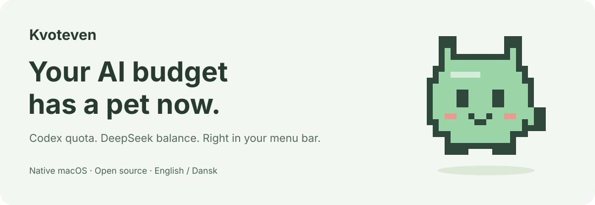
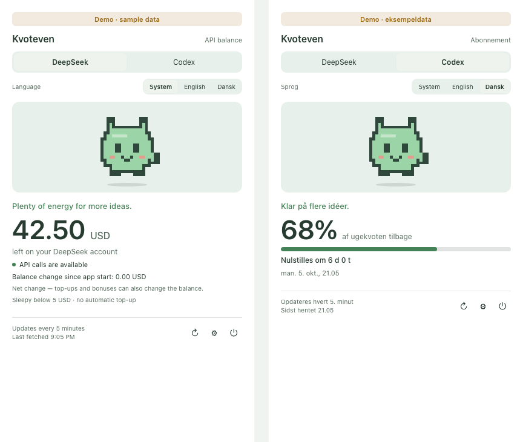

<p align="center"></p>

<p align="center">
  <a href="https://github.com/Mbvjdev/Kvoteven/actions/workflows/ci.yml"></a>
  · macOS · Linux · Windows · MIT · English / Dansk
</p>

# Stop opening a dashboard to check one number.

**Kvoteven is a tiny desktop pet that watches your Codex quota and DeepSeek balance.**
When there is plenty left, it is happy. When you are running low, it gets sleepy.
Click for the numbers. Get back to building.

*Kvoteven* is Danish for “quota buddy.” It does not eat your tokens, ask for attention,
or need its own subscription.

[Get started](#get-started) · [Dansk](README.da.md) · [Privacy](SECURITY.md) · [Releases](https://github.com/Mbvjdev/Kvoteven/releases)

> **Public beta — v0.4.0-beta.1.** [Download and test](https://github.com/Mbvjdev/Kvoteven/releases/tag/v0.4.0-beta.1).
> The Apple Silicon Mac DMG has passed local native tests. Windows, Linux and the
> universal Mac build are being tested in CI; packages are attached as they pass.
> Not production-approved or distribution-signed. Read the [known issues](docs/beta-0.4.0.md).

<p align="center"></p>

*The desktop interface in explicit offline demo mode. All numbers are fictional,
never the maintainer's account. This UI preview is not proof of a native package test.*

## Two accounts. One small friend.

| | What you see | What you do **not** get |
|---|---|---|
| **Codex / ChatGPT subscription** | Remaining weekly Codex quota and reset countdown | A combined meter for every ChatGPT feature |
| **DeepSeek API** | Official account balance, availability and net balance change since app start | A made-up weekly quota, token estimate or billing history |

- The pet lives in your system tray. macOS also shows the selected account's number in the menu bar; Linux/Windows show it in the tray tooltip and panel.
- The pet changes mood as the quota or balance falls.
- Choose **System, English or Dansk** inside the app. Numbers and dates follow the selected language.
- Light and dark appearance.
- Refreshes every five minutes. Stale or failed reads become `—`, not a reassuring old number.
- No Kvoteven cloud, analytics, model calls, purchases or automatic top-ups.

## Supported platforms (0.4.0 candidate)

| Platform | Package | Target OS | Signing today |
|---|---|---|---|
| macOS | Universal `.dmg` (Apple Silicon + Intel) | macOS 13+ | Ad-hoc — **not** Developer ID, **not** notarized |
| Linux | `.deb` (x86_64) | Ubuntu 22.04+ | Unsigned; SHA-256 checksums published |
| Windows | NSIS installer (x64, per-user) | Windows 10 / 11 + WebView2 | Unsigned; SmartScreen may warn |

These are **build targets**, not tested releases: no platform package has passed a CI run
yet. Treat every package as a prerelease candidate. See
[Distribution and signing](docs/distribution.md) for exactly what is and is not verified.

## Get started

### Download a public beta

Available beta packages are listed under
[GitHub Releases](https://github.com/Mbvjdev/Kvoteven/releases/tag/v0.4.0-beta.1) with SHA-256 checksums.
A missing platform is not ready yet; you can still build from source. Expect operating-system warnings because the packages are
not distribution-signed: Gatekeeper on macOS, SmartScreen on Windows, and no signed
repository on Linux.

### Build from source

You need [Node.js 22 LTS](https://nodejs.org/) and [Rust](https://www.rust-lang.org/tools/install)
(1.98.x is what CI pins). The shipped app has no Node/Python/Rust runtime requirement —
those are build-time only.

```sh
git clone https://github.com/Mbvjdev/Kvoteven.git
cd Kvoteven/desktop
npm ci --ignore-scripts
npm test
npm run build
cargo test --manifest-path src-tauri/Cargo.toml --locked
npm run tauri -- build --bundles app,dmg   # macOS; see docs/setup.md for Linux/Windows
```

Linux additionally needs the Tauri system libraries (see [setup](docs/setup.md)).
There is no autostart registration and no automatic updater; you update manually and
verify checksums from a release page.

### Try the pet before connecting anything

The app ships an explicit offline demo. In-app, open Settings and enable **Demo mode**,
or launch the native binary with:

```sh
# from desktop/src-tauri/target/release/ on macOS/Linux, .exe on Windows
./kvoteven --demo
```

The panel says **Demo · sample data** and shows fixed fixtures (42.50 USD / 68%). This mode
never reads credentials and never calls either provider. It is not a fallback when a live
read fails.

### Connect your existing accounts

- **DeepSeek** needs no Hermes and no Node/Python/Rust: enter your API key in Settings
  (a masked field) and it is stored in the OS keyring — Keychain on macOS, Credential
  Manager on Windows, Secret Service on Linux. There is no plaintext fallback.
- **Codex** reads quota through one of two read-only sources, selectable in Settings
  (**Auto / Codex CLI / Hermes**):
  - **Codex CLI** — install and log in with the official CLI (`codex login` in a terminal,
    OS versions per the [official docs](https://developers.openai.com/codex/)). Kvoteven
    does not perform the login itself.
  - **Hermes** — reuse your existing **default** Hermes profile's read-only usage output.
    No OAuth or tokens are copied out of Hermes.

**You do not need both providers.** Select the one you use; only the selected provider
is periodically refreshed. The choice, the language and the Codex source are remembered
across launches.

## Your account stays yours

Kvoteven does not upload credentials to a project server. There is no project server.

The DeepSeek key lives only in the OS keyring and is sent in an authorization header to
`https://api.deepseek.com/user/balance`. It is not put in process arguments, app
preferences, screenshots or the repository. Codex is read through the official CLI's
`app-server` protocol or Hermes' existing usage command; Kvoteven stores no Codex
credential at all.

Live snapshots and the DeepSeek comparison baseline stay in memory. Preferences persist
only your provider, language and Codex-source choices — never keys, logins or quota data.
Live verification commands print account numbers locally, so **do not paste their output
into public issues**.

Read the [security model and disclosure policy](SECURITY.md) for boundaries and limitations.

## The fine print, without the tiny font

**DeepSeek balance change is not a spending report.** It is current balance minus the
first balance read in this app session. Spending, top-ups and grants can all change it.
Restarting the app resets the baseline. USD and CNY remain separate; there is no FX
conversion. The pet's thresholds are hints, not a prediction of how much work you can do.

**Codex quota is provider-reported.** Missing weekly data stays missing. No other window
is silently relabelled as the weekly quota. Provider limits and response formats can change.
This app does not raise limits or bypass them.

**A sleepy pet is a hint, not a spending cap.** Kvoteven cannot stop other apps using your accounts.

## Help this little thing grow

If this saves you a trip to a dashboard, give it a star. Useful contributions right now:
translations, setup reports on other operating systems, and verified real-machine test
reports for the candidate packages. [Contribution guide](CONTRIBUTING.md).

Have a provider you'd like supported? [Open an issue](https://github.com/Mbvjdev/Kvoteven/issues/new/choose)
with a link to its documented balance or quota API. Please leave account data out.

## Development

```sh
cd desktop
npm ci --ignore-scripts
npm test
npm run build
cargo test --manifest-path src-tauri/Cargo.toml --locked
```

CI builds the app and renders both languages with synthetic data. It never receives
provider credentials. Live checks are separate, opt-in commands described in
[development notes](docs/development.md).

## The original macOS app

Version 0.3.0 — the native SwiftUI menu-bar app — is preserved as a legacy build under
`Sources/` and `scripts/build_app.py`. It is not the primary distribution going forward;
the Tauri desktop app above is. Don't mix the two build systems or test suites.

MIT licensed. Independent project; not affiliated with OpenAI, DeepSeek, Nous Research
or Tamagotchi/Bandai. The pixel pet is original artwork in this repository.
