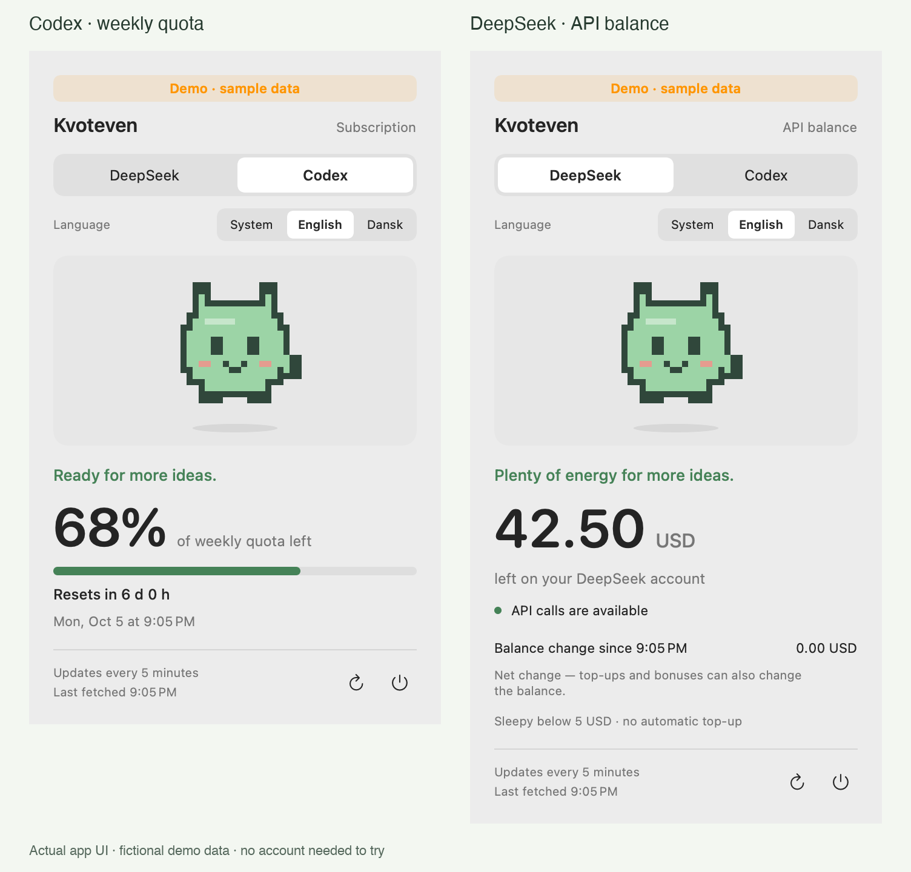

<p align="center"></p>

<p align="center">
  <a href="https://github.com/Mbvjdev/Kvoteven/actions/workflows/ci.yml"></a>
  · macOS 13+ · SwiftUI · MIT · English / Dansk
</p>

# Stop opening a dashboard to check one number.

**Kvoteven is a tiny menu-bar pet that watches your Codex quota and DeepSeek balance.**
When there is plenty left, it is happy. When you are running low, it gets sleepy.
Click for the numbers. Get back to building.

*Kvoteven* is Danish for “quota buddy.” It does not eat your tokens, ask for attention,
or need its own subscription.

[Get started](#get-started) · [Dansk](README.da.md) · [Privacy](SECURITY.md) · [Releases](https://github.com/Mbvjdev/Kvoteven/releases)

<p align="center"></p>

*Screenshots use deliberately fictional demo data, never the maintainer's account.*

## Two accounts. One small friend.

| | What you see | What you do **not** get |
|---|---|---|
| **Codex / ChatGPT subscription** | Remaining weekly Codex quota, reset countdown, other returned windows | A combined meter for every ChatGPT feature |
| **DeepSeek API** | Official account balance, availability and net balance change since app start | A made-up weekly quota, token estimate or billing history |

- The selected account's number lives in your menu bar.
- The pet changes mood as the quota or balance falls.
- Choose **System, English or Dansk** inside the app. Numbers and dates follow the selected language.
- Native SwiftUI + AppKit, light and dark appearance, reduced-motion support.
- Refreshes every five minutes. Stale or failed reads become `—`, not a reassuring old number.
- No Kvoteven cloud, analytics, model calls, purchases or automatic top-ups.

## Get started

> **Early preview:** live accounts currently require an existing [Hermes Agent](https://hermes-agent.nousresearch.com/docs/) installation. Kvoteven is not yet a standalone login client. Demo mode needs no account.

You need macOS 13+, Swift 5.9+ (Xcode Command Line Tools) and Python 3 to build.
The app has no third-party Swift packages.

```sh
git clone https://github.com/Mbvjdev/Kvoteven.git
cd Kvoteven
swift test
python3 -m unittest discover -s scripts -p 'test_*.py' -v
python3 scripts/build_app.py --install
open ~/Applications/Kvoteven.app
```

Close a running Kvoteven before installing an update. Nothing adds itself to Login Items.
The local build is ad-hoc signed, **not Apple-notarized**. This is a developer preview,
not an App Store release. Do not disable macOS security globally to run it.

### Try the pet before connecting anything

```sh
.build/release/Kvoteven --demo --language en
```

The panel explicitly says **Demo · sample data**. This mode never reads credentials or
calls either provider. It is not a fallback when a live read fails.

### Connect your existing accounts

Use Hermes' [provider setup](https://hermes-agent.nousresearch.com/docs/integrations/providers)
to configure the account you want. No key should go in this repository.

- **Codex:** authenticate through Hermes (`hermes model` → ChatGPT or Codex Subscription).
  The adapter reads the **default Hermes profile** via:
  `hermes --profile default usage --provider openai-codex --json`.
- **DeepSeek:** configure `DEEPSEEK_API_KEY` in Hermes' private `.env` via its setup.
  The local helper reuses that credential and calls the official balance endpoint.

This preview expects Hermes' standard git installation under `~/.hermes/hermes-agent`.
Your Hermes build must expose `usage` and `--print-runtime-command`; verify those commands
before installing. [Setup details and troubleshooting](docs/setup.md).

**You do not need both providers.** Select the one you use; only the selected provider
is periodically refreshed. The choice is remembered across launches.

## Your account stays yours

Kvoteven does not upload credentials to a project server. There is no project server.

For Codex, Hermes handles authentication and returns quota JSON. For DeepSeek, a local
helper reads the key through Hermes' credential resolver and sends it in an authorization
header to `https://api.deepseek.com/user/balance`. It is not put in process arguments,
app preferences or screenshots. The app does not create a second credential store.

Live snapshots and the DeepSeek comparison baseline stay in memory. Preferences store
only your provider and language selections. Live verification commands print account
numbers locally, so **do not paste their output into public issues**.

Read the [security model and disclosure policy](SECURITY.md) for boundaries and limitations.

## The fine print, without the tiny font

**DeepSeek balance change is not a spending report.** It is current balance minus the
first balance read in this app session. Spending, top-ups and grants can all change it.
Restarting the app resets the baseline. USD and CNY remain separate; there is no FX conversion.
The pet's default thresholds are 20 and 5 units of the reported currency, not a prediction
of how much work you can do.

**Codex quota is provider-reported.** Missing weekly data stays missing. No other window
is silently relabelled as the weekly quota. Provider limits and response formats can change.
This app does not raise limits or bypass them.

**A sleepy pet is a hint, not a spending cap.** Kvoteven cannot stop other apps using your accounts.

## Help this little thing grow

If this saves you a trip to a dashboard, give it a star. Useful contributions right now:
translations, setup reports on other Macs, and a standalone credential flow that preserves
the same security boundaries. [Contribution guide](CONTRIBUTING.md).

Have a provider you'd like supported? [Open an issue](https://github.com/Mbvjdev/Kvoteven/issues/new/choose)
with a link to its documented balance or quota API. Please leave account data out.

## Development

```sh
swift test
python3 -m unittest discover -s scripts -p 'test_*.py' -v
python3 scripts/build_app.py
python3 scripts/check_public_tree.py
```

CI builds the app and renders both languages with synthetic data. It never receives
provider credentials. Live checks are separate, opt-in commands described in
[development notes](docs/development.md).

MIT licensed. Independent project; not affiliated with OpenAI, DeepSeek, Nous Research
or Tamagotchi/Bandai. The pixel pet is original artwork in this repository.
